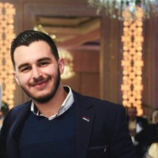

# Mohamad AL MELL

Abou Samrah, Al Maytam Street, Tripoli, Lebanon, 1300 | +961 71 846709 | mohamadalmell@gmail.com

## Objective

To obtain an entry-level position in Civil Engineering.

## Why Me

I am a self-motivated, hard-working Structural Engineer. Graduate student with a broad foundation in engineering principles. Completes advanced academic projects demonstrating engineering support capability. I have the capacity to manage site works to produce the best quality of work in the least amount of time.

## Education

### UNIVERSITY OF MICHIGAN, COURSERA | WEB DESIGN FOR EVERYBODY: BASICS OF WEB

### DEVELOPMENT & CODING

· Completion Date : September 2021

### FREECODECAMP | RESPONSIVE WEB DESIGN

· Completion Date : September 2021

### UNIVERSITY OF CALIFORNIA, COURSERA | INITIATING AND PLANNING PROJECTS

· Completion Date : November 2020 · Grade: 94%

### ISAE CNAM LIBAN | MASTER OF ENGINEERING IN STRUCTURAL ENGINEERING

· Graduation Date : January 2020 · GPA: 3.

### ISAE CNAM LIBAN | BACHELOR OF ENGINEERING IN CIVIL ENGINEERING

· Graduation Date : July 2017 · GPA: 3.

### GEORGES SARRAF HIGH SCHOOL | BAC II IN GENERAL SCIENCES

· Graduation Date : July 2014

## Skills & Abilities

Adaptable, Calm, Hard Worker, Team Member, Problem Solver, Microsoft Office, AutoCAD, ETABS, SAFE, Advance Design, HTML5, CSS3, Javascript, Responsive Web Design.

## Experience

### Relevant Experiences:

### SHELTER ASSISTANT | MEDAIR LEBANON | NOV 2020 – DEC 2020

· Prepared a complete Bill of Quantities (BOQ) for each shelter unit technically evaluated on the field with the definition of items, describing the specifications, the quantity and the quality of materials required; 
· Visited, daily, shelter units assessing the quality and quantity of the work done by the contractor; 
· Ensured quality assurance of material specification and selection and robustness in design and construction; 
· Ensured good quality workmanship, through clear explanation of the intervention to the Contractor on site; 
· Ensured all paper work is accurate and correctly stored; 
· Prepared the weekly and monthly report for my sector of responsibility. 

### TRAINEE ENGINEER | E.CONSTRUCT FZ-LLC DUBAI, UNITED ARAB EMIRATES | JUL 2018 –

### OCT 2018

· Performed on-site field inspections and wrote technical narratives to document processes and design changes; 
· Reviewed and checked technical drawings by architectural technicians, CAD technicians and drafters; 
· Reviewed shop drawings and coordinated with architectural, mechanical and electrical engineers to maintain Design requirements after changes. 
· Checked members’ forces and stresses after design changes. 

### TRAINEE ENGINEER | E.CONSTRUCT FZ-LLC DUBAI, UNITED ARAB EMIRATES | JUL 2017 –

### OCT 2017

· Performed on-site field inspections and wrote technical narratives to document processes and design changes; 
· Checked post tension members’ stresses, number of strands and quantity of additional reinforcements. 
· Checked long-term and mid-term deflection of horizontal members. 

### TRAINEE ENGINEER | E.CONSTRUCT FZ-LLC DUBAI, UNITED ARAB EMIRATES | JUL 2016 –

### SEP 2016

· Calculated load levels and material stress factors to identify design constraints. 
· Initiated 3D models of buildings to check its members’ capacity and resistance. 

### Other Experiences:

### PART-TIME SALESMAN | AL MELL INSTITUTION FOR JEWELRY | JUL 2012 – SEP 2015

· Followed up with customers after completed sales to assess satisfaction and resolve any technical or service concerns. 
· Computed total costs and profit requirements for customer sales to provide accurate pricing. 

## Languages

### ARABIC

#### · Mother Tongue

### ENGLISH

#### · BULATS B2

### FRENCH

#### · DELF B2

